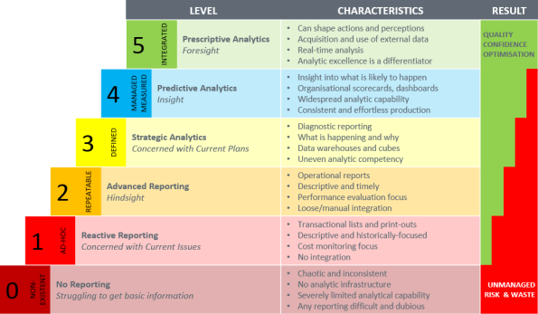
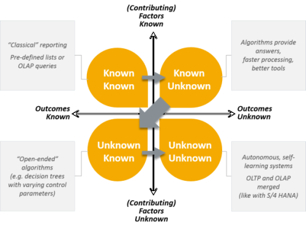
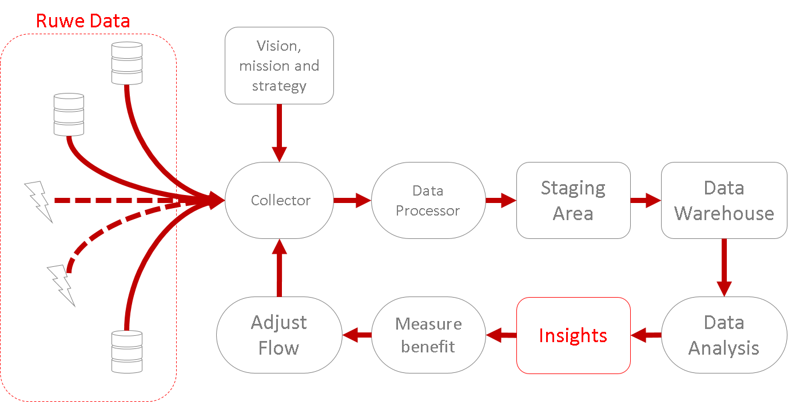

# Intro BI (32321/1700/1920/1/27)

## Introductie Business Intelligence

### Wat is Business Intelligence

Voor deze cursus hanteren we de volgende definitie:

>Business intelligence (BI) is de poging van een onderneming om via **beschikbare gegevens** binnen de **eigen handelsactiviteit** **inzichten** te verwerven. Deze inzichten moeten leiden tot het nemen van de **juiste beslissingen**. Op hun beurt moeten deze juiste beslissingen een **concurrentievoordeel** bieden.

Business intelligence is dus een werkwoord eerder dan een zelfstandig naamwoord. De gegevens zelf zijn geen BI totdat iemand er nuttige informatie kan uithalen. De databank systemen waarop deze data zijn opgeslagen zijn evenmin BI. Ook de totale kennis binnen de onderneming (knowledge base) is in principe geen BI in de nauwe zin van het woord. Het beheren van de gegevens om tot een vruchtbare knowledge base te komen, dát is BI.

### BI Maturity Model

Er werden verscheidene maturity models gebruikt in het verleden telkens met het doel om ondernemingen te classificeren op een schaal die de data-geletterdheid moet aangeven.

<small>[Bron](https://www.xelocity.com)</small>

Onderaan de ladder heb je de ondernemingen die geen gegevens capteren of er toch niets mee doen. Een eerste stap naar data-geletterdheid is het capteren van de gegevens rond specifieke gebeurtenissen zoals het verlies van een  klant, het verlies van een lading en zo meer. Op niveau 2 vind je de ondernemingen die het rapporteren van gegevens meer formaliseren en er standaard procedures voor hebben (SOP). Van niveau 3 to 5 gaat er telkens meer en betere analyse op de data kunnen gebeuren.

De eenvoudigste vorm van analyse is retrospectief. Dit type analyse beantwoordt de vraag: *wat is er precies gebeurd?*

Voorbeelden:

- Wanneer is de kwaliteit van het product beginnen achteruit lopen en is er misschien toen iets gebeurd dat de kwaliteitsval kan verklaren
- Hoeveel SKU's (Stock Keeping Unit = Voorraadbeheer eenheid) in het fancy-pants assortiment zijn er verkocht van 2000 tot heden in de vestigingen in Hasselt. Is het nog de moeite deze collectie daar voort te zetten?
- Is er een seizoensgebonden factor in de verkoopcijfers van onze plastieken bekers en kunnen we dat niet uitspelen om efficiënter de productie te sturen?

Een meer geavanceerde vorm van analyse is de voorspellende analyse (predictie analytics). Typisch maakt deze vorm van analyse gebruik van Machine Learning (ML). Nu kunnen er veel interessantere vragen gesteld worden:

- Gegeven de data die we van marktanalysten hebben gekregen, kunnen we voorspellen of het de moeite loont om een nieuw vestiging te openen in Moeskroen?
- Onze pijnstillers werken niet goed, kan je voorspellen of ze misschien kunnen ingezet worden om een ander kwaal te bestrijden?
- Er is steeds meer volatiliteit op de bevoorrading van de onderdelen voor de Ford Fiesta. Kunnen we een simulatie lopen met een extra stockage ruimte van 3000m² in Beringen om na te gaan of we dat probleem in de toekomst kunnen verhelpen?

De meest vooruitstrevende vorm van analyse is de prescriptieve analyse. Hier komt het erop neer dat een soort digitale agent in staat is om de manager te vertellen wat er moet gebeuren. In zuivere AI (artificiële intelligentie) wordt er zelfs een stap verder gegaan en krijgt de digitale agent de verantwoordelijkheid om zelfstandig het systeem aan te sturen.

Voorbeelden prescriptief:

- Op basis van de weersvoorspellingen vertelde ons systeem (de agent) me dat er volgende week 2300L melk zal nodig zijn voor onze ijsroomwagens. Dat lijkt me realistisch, je mag de bestelling plaatsen.
- De verkoop van dit product lijkt vrij goed voorspelbaar te zijn door Google trends statistieken. Het systeem voorspelt nu dat de verkoop een sterke terugval gaat krijgen. De tegenvallende Google trend cijfers lijken me echter eerder gestuurd te zijn door de voorbije vakantiedagen. Ik vraag aan onze datawetenschappers om het algoritme aan te passen zodat het rekening houdt met vakantiedagen en dan zien we wel weer.

Voorbeelden AI:

- Het systeem voorspelt dat pers 3A aan onderhoud toe is en heeft de planning aangepast. Ik heb het automatisch gegenereerd rapport nagekeken en alles lijkt in orde dus ga ik de planningwijziging niet ongedaan maken.
- Om de seizoens-afhankelijke variatie in de verkoop in rekening te brengen is de digitale agent beginnen onderhandelen met onze voornaamste distributeur. Het resultaat is dat er een extra transport zal plaatsvinden elke maandag en donderdag en dat we een extra korting van 5% kunnen genieten.

Er bestaan meerdere versies van zulke maturity modellen, maar het gaat dus steeds om een poging de data-geletterdheid van een onderneming te kwantificeren.

## De Rumsfeld matrix

Op 12 februari 2002 antwoordde Donald Rumsfeld als volgt op de opmerking dat er geen bewijs was voor massavernietigingswapens in Irak:

> *"Reports that say that something hasn't happened are always interesting to me, because as we know, there are known knowns; there are things we know we know. We also know there are known unknowns; that is to say we know there are some things we do not know. But there are also unknown unknowns—the ones we don't know we don't know. And if one looks throughout the history of our country and other free countries, it is the latter category that tend to be the difficult ones"* — Donald Rumsfeld

OK, maar wat heeft dit met BI te maken? Deze matrix kan aangewend worden om aan ondernemingen duidelijk te maken dat er vaak méér data ter beschikking is dan eerst gedacht:

De bedoeling is dat de onderneming op termijn leert te ontdekken welke data beschikbaar zijn waarvan men het eerst niet wist. In het laatste stadium leert de onderneming antwoorden zoeken op veel complexere vragen doordat systemen in staat zijn gaten in de kennis te ontdekken waarvan men eerst niet eens wisten dat het gaten waren.

> Opdracht:
>
> - Lees het artikel rond "[Practical Steps In Building Analytical Maturity](https://www.xelocity.com/site/page/article.asp?fpar=b413f3b3c5f5d4c)" van Chris Rodgers (Xelocity)
> - Bekijk de videos die het resultaat zijn van de [PwC's Global Data and Analytics Survey 2016](https://www.pwc.com/us/en/services/consulting/analytics/big-decision-survey.html)

### Van Gegevens naar Inzichten

Het onderstaand schema geeft een helikopter zicht van wat de data-gedreven (data-driven) onderneming wil bekomen:

Laten we dit schema even onder de loupe nemen. We beginnen bij de missie en visie van de onderneming. Daarin worden de high-level doelstellingen vastgelegd en een soort operationele strategie bepaald. Hieruit moet gedestilleerd kunnen worden (naast vele andere zaken) welke databronnen er aangeboord moeten kunnen worden. Gegevensbronnen ontdekken is één zaak maar die data ook binnenhalen (**Collector**) is nog iets anders. Het probleem is dat de gegevens soms in andere formaten beschikbaar worden gemaakt dan wat de onderneming gewoon is. Misschien worden de data enkel als data-stroom ter beschikking gesteld. We gaan leren wat het allemaal met zich meebrengt om dit tot een goed einde te brengen. Niet alle data van een bepaalde bron zal nuttig blijken te zijn en misschien wil je een filter toepassen. Misschien moeten er velden worden opgekuist of getransformeerd (**Data Processor**). Dit vereist dan weer dat er een voldoende groot begrip is van de data en het is typisch ook het werk van data wetenschappers om alle velden te begrijpen en proberen in te schatten of deze gegevens waardevol kunnen zijn. In de **Staging Area** Worden de gegevens opgeslagen, het is dus niet meer of minder dan een databank.

Als de data netjes zijn opgeslagen, kan men beginnen met het **data analyse** proces. Dit omhelst achtereenvolgens het creëren van een **Data Warehouse** (DWH) en de descriptieve (Data mining),predictieve (ML) an/of prescriptieve (AI) analyse van de gegevens. Uiteindelijk moet de analyse leiden tot betere inzichten en leiden deze inzichten hopelijk tot een performantie winst voor de onderneming. Tenslotte zal een sterk data-geletterde onderneming een proces hebben uitgetekend om dit hele proces waar nodig bij te sturen (**Adjust flow**).

De cursus zal ongeveer ingedeeld worden volgens bovenstaande flow. We beginnen bij de onderneming met zijn visie en missie.
