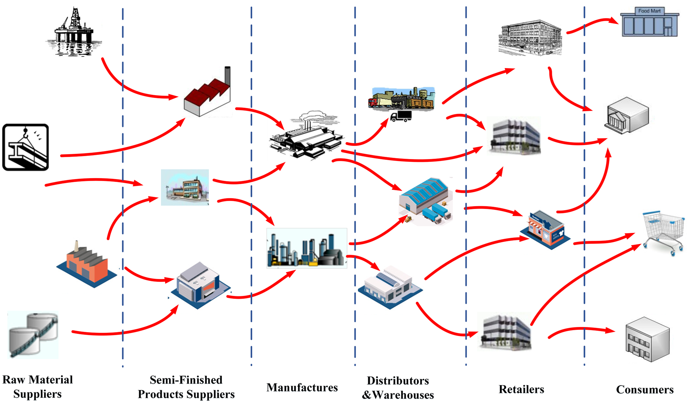
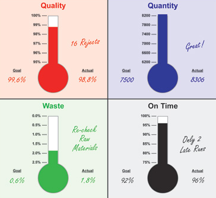
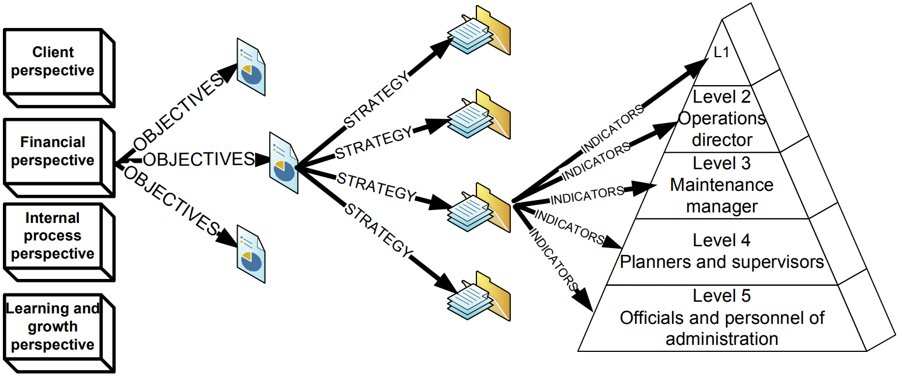

# Intro BI (32321/1700/1920/1/27)

## De onderneming

'De' onderneming wordt steeds moeilijker te definiëren. In rechterlijke termen lukt het nog: elke onderneming (bedrijf/firma/legal entity) heeft een uniek ondernemingsnummer, is een unieke entiteit in de Kruispuntbank voor Ondernemingen ([KBO](https://economie.fgov.be/nl/themas/ondernemingen/kruispuntbank-van/diensten-voor-iedereen/kruispuntbank-van-0)), is een natuurlijk of rechtspersoon, heeft één of meerdere vestigingen en is gekoppeld aan één of meerdere handelsactiviteiten zoals beschreven door middel van [NACE-BEL codes](https://statbel.fgov.be/sites/default/files/Over_Statbel_FR/Nomenclaturen/NACE-BEL%202008_NL.pdf) (zie ook [hier](https://nl.wikipedia.org/wiki/NACE-code) voor meer info hierover).

Het probleem begint te ontstaan als je spreekt van de onderneming en zijn concurrenten. Ondernemingen zijn vaak afhankelijk van distributeurs, leveranciers, stockage en andere partijen en deze zijn vaak extern (die dus niet tot de zogenaamde legal entity behoren) en worden gedeeld met de concurrentie:

Men spreekt van **bevoorradingsketens** (supply chains) maar in feite gaat het tegenwoordig niet langer om ketens maar om heuse netwerken. Waarom is dit belangrijk? Omdat...

> Het succes van een onderneming hangt steeds meer af van het succes van de bevoorradingsketen. In plaats van een wereld van ondernemingen die in competitie staan met elkaar kan men dus steeds vaker spreken van bevoorradingsketens die in competitie staan.

Herinner je je dat het voorname doel van Business Intelligence was om competitiever te zijn. Dat betekent dus ook dat we de werking van bevoorradingsnetwerken zullen moeten begrijpen.

> Behalve de bevoorradingsnetwerken zijn er nog vele afhankelijkheden waar een bedrijf mee moet rekening houden. De belangrijkste hebben met wetgeving (legislation) en met politiek (internationale prijsafspraken en handelsverdragen) te maken. Deze afhankelijkheden kunnen *bepalend* zijn voor de overlevingskansen van een bedrijf.

> Optioneel leesvoer:
> - [Beste bevoorradingsnetwerken ter wereld](https://www.hollingsworthllc.com/best-supply-chains-companies-around-world/)
> - [Gartner's Top 25](https://www.gartner.com/en/supply-chain/research/supply-chain-top-25)

## Missie en Visie

Hier gaan we niet te diep op in, omdat je dit al ruim in andere cursussen aan bod komt. Een visie van een onderneming wordt vaak openlijk gepubliceerd en geeft aan welke richting een bedrijf wil gaan. Een bekend voorbeeld is het [Credo van Johnson & Johnson](https://www.jnj.com/credo/) dat door elke werknemer van het bedrijf gekend is en ook dagelijks wordt aangehaald om beslissingen te sturen. Dit credo vat de 4 verantwoordelijkheden samen die van generatie tot generatie worden doorgegeven en waar niemand wag van afwijken. Het vormt in dit geval het ethisch kader waarbinnen de onderneming belooft te handelen. Er bestaat binnen dit bedrijf een netwerk van mensen die moeten instaan voor het naleven van het Credo. Een andere bekend voorbeeld zijn [Toyota's 10 geboden](https://books.google.be/books?id=qzPoQgAACAAJ&dq=Ten+Commandments+of+Taiichi+Ohno&hl=nl&sa=X&ved=0ahUKEwjstd_ftMvkAhXKJFAKHfOlAAIQ6AEIKTAA). Zulke visies veranderen niet of nauwelijks in de loop de jaren.

De visie leidt onmiddellijk tot een missie (beloftes om de visie waar te maken) en uiteindelijk tot een strategie (hoe maken we de missie een realiteit). Deze zijn meestal veranderlijker en afhankelijk van de reële marktsituatie. In de strategieën van een data-driven ondernemingen zal beschreven staan hoe gegevensbronnen aangeboord moeten worden en hoe de daaruit ontspruitende inzichten verspreid moeten worden onder zijn werknemers.

> De Business-analist die verantwoordelijk wordt gesteld om een DWH op te stellen, werkt dus niet 'in het ijle' en heeft altijd wel ergens een set van afspraken na te leven.

## Critical Success Factors (CSF) en Key Performance Indicators (KPI)

Als KPI's de thermometers van het bedrijf zijn, dan zijn de kritische succes factoren de warm-en koudwater kraan:

Deze KPI's zijn vaak nogal high-level. Hoe meet je bijvoorbeeld de kwaliteit voor een bedrijf als Unilever met een jaarlijkse omzet van méér dan 50 miljard euro en 161 000 werknemers? Dit gebeurt door het uitwerken van een zogenaamde KPI hiërarchie:

<small>Bron: Galar, D., Parida, A., Kumar, U., Stenström, C., & Berges, L. (2011, September). Maintenance metrics: a hierarchical model of balanced scorecard. In 2011 IEEE International Conference on Quality and Reliability (pp. 67-74). IEEE.</small>
