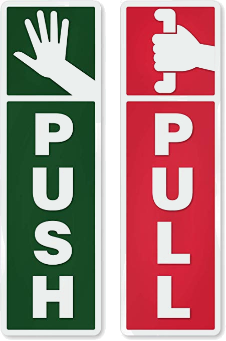

# Intro BI (32321/1700/1920/1/27)

## Data Extraction

### Push - Pull

Laten we beginnen bij de E van ETL. Data moet altijd getransporteerd worden van de bron naar zijn bestemming. Zowel de bron als de bestemming kunnen hier het initiatief nemen om dit transport te verwezenlijken. Neemt de bron hiervoor het initiatief, dan spreekt men van het **Push-principe**, anders gaat het om het **Pull-principe**.

Welk van beide principes je moet aanhouden, hangt van een aantal factoren waaronder:

- *Beschikbaarheid van de data* - welk tijdstip kunnen de data worden getransporteerd
- *Toegankelijk* - Wie heeft de juiste rechten om het data transport te beheren

Typisch wordt er een is een tussenvorm gevolgd, er worden ter hoogte van de databron op regelmatige tijdstippen data **'ge-pushed'** op een (publieke) server en de bestemming staat zelf in om die gegevens te gaan **'pullen'** van die server. Om te weten of er dan nieuwe gegevens beschikbaar zijn, zou de bron een kort berichtje kunnen sturen naar de geregistreerde afnemers. Alternatief kan de bestemming een systeem opzetten om op geregelde tijdstippen te controleren of er inderdaad al nieuwe gegevens beschikbaar zijn.

### Staging Area

> De staging area dient als sluis om alle gegevens, meestal tijdelijk, te bewaren op eenzelfde fysische plek. Met ander woorden, eenmaal de gegevens uit de staging area doorgegeven werden naar de DWH, mogen deze uit de staging area verwijderd worden.

In de praktijk kan een staging area een (folder op een) shared drive zijn, een databank of een combinatie van beide zijn. Er moet voor gezorgd worden dat die gegevens die reeds doorgestuurd werden naar de DWH gescheiden blijven van de nieuwe gegevens.

<small>[Bron](https://optimalbi.com/blog/2018/04/18/persistent-staging-area-with-ode/)</small>