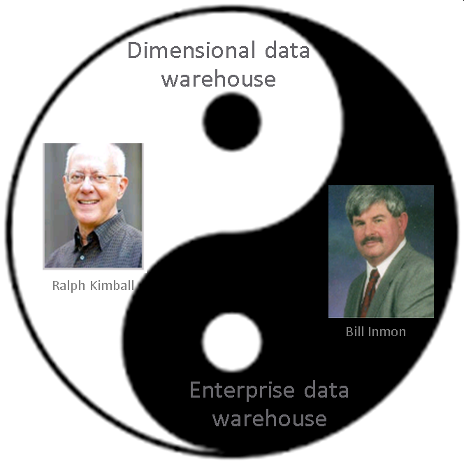
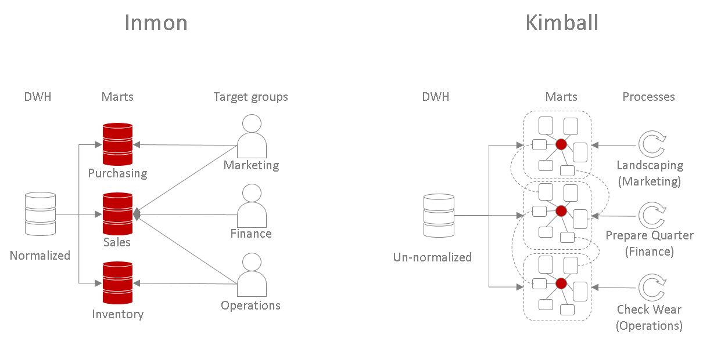
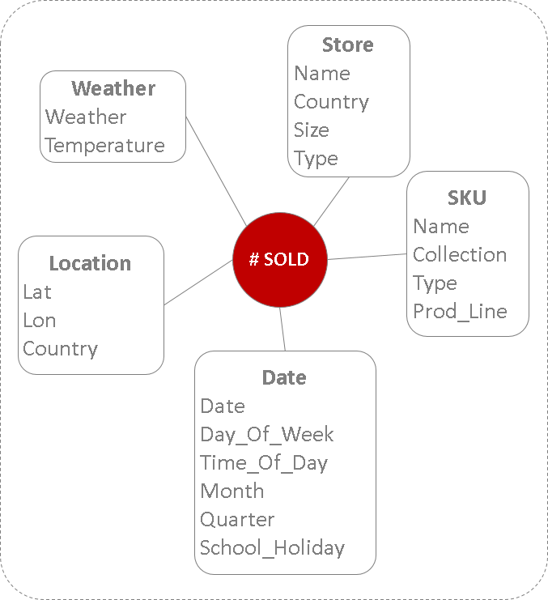
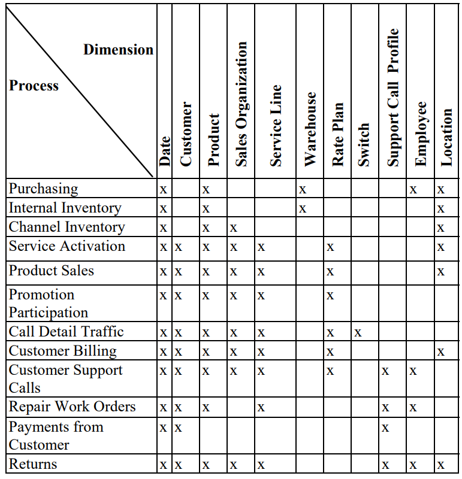
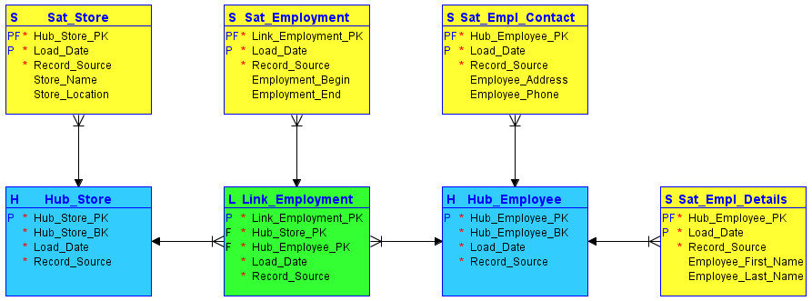

# Intro BI (32321/1700/1920/1/27)

## De Datawarehouse

### Introductie tot de DWH

> Een DWH kan gezien worden als een grote gegevensbank die in staat is om verschillende views op de data weer te geven en waarbij verschillende views typisch ook voor verschillende profielen of afdelingen bedoeld zijn

De voornaamste kenmerken van een DWH zijn de volgende:

- Het kunnen opslaan van gegevens
- Het kunnen omgaan met grote hoeveelheden gegevens
- Het kunnen bewaren over een lange termijn
- Het eenvoudig en flexibel beschikbaar kunnen stellen van de gegevens

Waar de staging area dient als sluis om alle gegevens, meestal tijdelijk, te bewaren op eenzelfde fysische plek, dient de DWH om alle data op een **éénduidige manier** en over een **langere termijn** te stockeren. Men spreekt soms ook van een EIO of Eenduidige Informatie Omgeving maar deze afkorting is een beetje afgekeken van de Engelse afkorting EOI hetgeen staat voor Enterprise Operational Intelligence. Het komt erop neer dat in gegevens afkomstig van verscheidene bronnen de volgende zaken worden gelijk getrokken:

- Identificatie
- Formattering
- Categorieën
- Codering van ontbrekende gegevens
- Betekenis
- Eenheden

### Voorbeeld

Laten we eerst een vereenvoudigd voorbeeld bekijken van hoe gegevens na een data transformatie-pipeline in de DWH terecht komt:

### SPOT

SPOT is een erg belangrijk principe in BI. Het staat voor **Single Point of Truth**. Het komt erop neer dat de data in de DWH niet enkel dient voor de opslag van de gegevens, maar ook als referentie dient. De data in de DWH moeten dus als de waarheid en de enige waarheid beschouwd worden. Bijvoorbeeld, de verkoopscijfers in de DWH mogen geen afkooksel zijn van een andere dataset die wel de accurate en betrouwbare gegevens bevat. Een goede DWH moet dus ook de functie van SPOT hebben. Denk eraan dat de SPOT ook moet overeenstemmen met de missie en de visie van de onderneming!

Dit zijn de doelstellingen van een SPOT nog eens op een rijtje:

- Een zo eenvoudige mogelijk architectuur
- Het zo accuraat en betrouwbaar mogelijk maken van de data
- Het gemakkelijk kunnen afschermen van de data (o.a. afschermen van de concurrentie)
- Het kunnen koppelen van de data met de missie en visie van de onderneming
- De data-geletterdheid bij alle werknemers te maximaliseren
- Het vermijden van verscheidene versies van dezelfde gegevens verspreid over meerdere afnemers en het vermijden van synchronisaties
- Het beperken van het onderhoud (toevoegen, aanpassen, verwijderen, archiveren,…) van de gegevens

### Operational Data Store en Data Marts

Afhankelijk van de noden van de onderneming en de gekozen rapporterings-technologie (zie later) kan er soms ook een opslag zijn voor samenvattende statistieken. Wordt er bijvoorbeeld dagelijks een rapport opgevraagd over de nieuw aangesloten klanten, dan kan ervoor gekozen om de data voor het opstellen van deze rapporten, alsook de rapporten zelf (PDF, DOCx, …) te bewaren en dat gebeurd dan in een **ODS of Operational Data Store**.

Een gelijkaardig principe is het gebruik van zogenaamde Data Marts (DM). Bij DM is er meestal één DM per afnemersgroep. Een afnemersgroep kan zijn een hele afdeling van de onderneming, financiën bijvoorbeeld, of kan gaan over een heterogene groep binnen de onderneming zoals de groep van de datawetenschappers die verspreid kunnen zijn over meerdere afdelingen. Voor dit laatste voorbeeld, waarbij gegevens specifiek voor data mining wordt bewaard, spreekt men ook wel eens van een DMO of Data Mining omgeving. In een DMO heeft de gebruiker veel grotere flexibiliteit om nieuw verbanden tussen de data te onderzoeken, maar moet de gebruiker ook meer technische skills hebben om aan de data te kunnen.

Zowel ODS's als DMs hebben het nadeel dat ze nogal veel onderhoud vragen. Er moeten mensen continue bezig zijn met het onderhouden van het rapportering en van de onderliggende gegevens. Databronnen veranderen namelijk regelmatig maar de wensen van de afnemers veranderen nog vaker. Die overhead komt natuurlijk met een kost en er zijn ondernemingen die eerder trachten om de gebruikers rechtstreeks te koppelen aan de DWH, zonder tussenliggende opslagplaats.

### Hoofdtaken van de DWH architect

Wordt er een nieuwe DWH opgezet of wordt er een bestaande aangepast, dan zal de verantwoordelijk architect voor drie zaken moeten instaan:

- Gevoel/gebruik : De gebruiker moet het gevoel krijgen dat het even gemakkelijk is als voorheen om aan de data te kunnen. Indien dit inderdaad een vereiste is, dan is men ook verantwoordelijk om dit achteraf ook te toetsen. Er zullen dus usability testen uitgevoerd moeten worden opgezet.
- Topologie : Dit gaat over de logische samenhang van het data model. Het data model moet voor nieuwe werknemers ogenblikkelijk duidelijk zijn en afgestemd zowel op de noden van de DB admins als die van de afnemers! Dit is vaak een uiterst moeilijke opdracht en er zal bijna steeds een compromis gevonden moeten worden.
- Technologie : Binnen de wereld van BI beweegt er veel. Dat is altijd al zo geweest maar met de komst van AI is dit alleen maar versneld. De architect moet ook hier de juiste keuzes maken naar betrouwbaarheid (oude systemen hebben de tand des tijds doorstaan), duurzaamheid (bijv. is de hoeveelheid onderhoud evenredig met de hoeveelheid data), populariteit (om technici aan te trekken), ….

### Afnemersprofielen

Zoals besproken kunnen er verschillende afnemers zijn voor de data. Je kan deze in twee groepen indelen:

- Business - dit zijn de afnemers die op basis van klaargestoomde rapporten of dashboards beslissingen gaan moeten nemen
- Technisch - dit zijn de IT'ers en de datawetenschappers die meer flexibiliteit nodig hebben, zelf de data moeten kunnen exploreren, relaties maken, views creëren, archiveren, …

### Exploratietypes

Er kunnen twee stromingen onderscheiden worden in het exploreren van de gegevens en die komen overeen met de twee afnemersprofielen:

- OLAP - Dit is **Online Analytical Processing**, hetgeen voor velen trouwens een verwarrende term is, wordt eerder door Business afnemersprofielen gebruikt. In dit proces worden fact-gegevens onderzocht door ze te projecteren op één of meerdere dimensies. Typisch worden er drie dimensies gebruikt waardoor er een puntenwolk ontstaat die afgelijnd wordt door een kubus. Men spreekt dan ook van OLAP kubussen of cubes.
- **Data mining** - dit gaat kan over het flexibel kunnen queryen van de data (bijvoorbeeld d.m.v. SQL) om nieuwe verbanden aan het licht te brengen, nieuwe dimensies te definiëren of nieuwe databronnen voor te stellen.

Denk eraan dat *exploratieve analyses* betekent dat er gekeken worden naar de bestaande data zonder nadrukkelijk in te zetten op het voorspellen voor de toekomst.

### DWH Architectuur

Er zijn twee stromingen in het opzetten van een architectuur voor een DWH. Men spreekt van het Inmon en het Kimball model. Zoals vaak gaat het hier om twee extremen van een continuum aan mogelijk oplossingen en bestaan er meestal tussenvormen:

|               | Inmon                                     | Kimball                                                       |
| ------------- | ----------------------------------------- | ------------------------------------------------------------- |
| Creation      | Data &rarr; Normalized Model &rarr; Marts | Processes &rarr; Needs &rarr; un-normalized model &rarr; Marts |
| Build         | Slow                                      | Fast                                                          |
| Staging       | Fast                                      | Slower                                                        |
| Model         | Logical                                   | Practical - integration through *conformed dimensions*        |
| Querying      | Complex, many joins needed                | Fast and easy, few joins needed                               |
| Direct access | No (all access trough data marts)         | Yes                                                           |
| Size          | Large                                     | Smaller in the beginning                                      |
| Structure     | One mart per department                   | One mart per target group                                     |
| Updatability  | Easy                                      | Less                                                          |
| ETL issues    | Fewer                                     | More                                                          |
| Maintenance   | Expert level                              | Easier, procedural                                            |

[Bron: Stanford. 2003. “Data Warehousing Concepts” (accessed 5/26/2016)](https://web.stanford.edu/dept/itss/docs/oracle/10g/server.101/b10736/concept.htm#i1006297)

Hieronder nog eens een visuele voorstelling van de verschillen tussen beide architecturen:

Kimball lijkt al vele jaren de meest populaire van beide strategieën, maar dit neemt niet weg dat er mogelijk situaties bestaan waarbij Inmon toch beter geschikt is.

### Ster-Schema

> Het schema in het architectuurmodel van Kimball neemt een stervorm aan met centraal **de fact** en daarrond de **dimensies** die relevant lijken voor de afnemers

Zoals eerder aangehaald zijn fact meetbare feiten (bekijk deze [theorie](BI_03_Databronnen.md) best nog eens even opnieuw) en stellen de **dimensies** de assen voor waarop je deze waarden wil projecteren. Hieronder is een fictief voorbeeld van een star outline

Merk op dat in het schema hierboven de ID-velden werden weggelaten. Zo zou in dit voorbeeld de fact tabel in een relationele databank in feite 5 velden bezitten: vier voor de zogenaamde foreign keys te bewaren en eentje voor de eigenlijke waarden van de fact.

Een ster schema kan één tot tientallen dimensies hebben. Wanneer de gebruik een nieuwe OLAP kubus wil genereren, kan hij of zij uit deze dimensies kiezen. In principe moet elke combinatie van dimensies mogelijk zijn dus voor bijvoorbeeld 3 dimensies in de OLAP kubus en 7 dimensies beschikbaar zijn er 35 mogelijke OLAP kubussen.

Geïnteresseerd hoe je dat berekend?

$${7 \choose 3}=\frac{7!}{3!(7-3)!}=35$$

 

### Modulair

In bovenstaand voorbeeld werd één ster schema getoond, maar in werkelijkheid zullen er meerdere sterschema's voorkomen. Voor elke doel groep minstens één sterschema en zelfs binnen kleine KMO's zijn er al gauw een vijftal doelgroepen (Financiën, Marketing, Operationeel/Productie/Logistiek, Management, Analyse, HR,&hellip;). Als iedere doelgroep zijn eigen facts met eigen dimensies zou hebben zou het geheel een onoverzichtelijk kluwen worden. De bedoeling is om de dimensies gekoppeld aan een fact dan ook te hergebruiken voor andere facts binnen andere sterschema's.

> Om dimensies te kunnen hergebruiken over meerdere facts is natuurlijk een vorm van standaardisering nodig. Men spreekt van **Conformed dimensions**.

### DWH Bus

> Een DWH bus is een architectuuraal ontwerp waarbij the kerntaken van de onderneming worden gekoppeld aan de dimensies. Het is een hulpmiddel tijdens de planning fase van het DWH ontwikkelingsproces

<small>[Bron](https://ie.utcluj.ro/files/acta/2015/Number3/MPS2015_Bogza.pdf)</small>

Een DWH bus laat toe om goed na te denken over het uitrollen van een DWH. Er komt immers wel wat bij kijken en zo kan men stapsgewijs de DWH uitrollen terwijl de kerntaken met hoogste prioriteit eerst worden afgehandeld (dus rij per rij in de matrix). Elke kerntaak komt trouwens overeen met een set van één of meerdere facts. De DWH bus help zo ook om, stapsgewijs, het ganse datamodel op te bouwen.

### Data Vaults

De bovenstaande principes houden vaak te weinig rekening met veranderingen in de databronnen en veranderingen in het bedrijf zelf. Het principe van Data Vaults probeerde hieraan te verhelpen door:

- Data transformaties later (in de DMs) te laten gebeuren
- Zogenaamde Business keys en hun onderlingen relaties (hubs & links) te onderscheiden van andere features (satellites & refs) wegens een verschil in levensduur

De ontwerper van dit systeem, Dan Linstedt, verwoordde het zo:

"The Data Vault Model is a detail oriented, historical tracking and uniquely linked set of normalized tables that support one or more functional areas of business. It is a hybrid approach encompassing the best of breed between 3rd normal form (3NF) and star schema. The design is flexible, scalable, consistent and adaptable to the needs of the enterprise"

Is is een vereenvoudigde data vault:

<small>[Bron](https://en.wikipedia.org/wiki/Data_vault_modeling), hubs zijn blauw, links groen en satellieten geel</small>

### Surrogaat Sleutels

Een zogenaamde **Surrogate Key** is een door het systeem-gegenereerde interne en technische sleutel die niet afkomstig is van de data zelf maar als doel heeft om te verzekeren dat alle data elementen een uniek referentie bevatten. Waar vroeger eerder oplopende rijnummers werden gebruikt, biedt het gebruik van **Unique identifiers** veel meer voordelen.

### Process voor Data Vaults

1. Laden van de Hubs
2. Creëer surrogaat sleutels
3. Indien van toepassing: Opzetten (en opkuisen!) van de Link tabellen (denk aan het NoSQL principe en het gebruik van *documenten*)
4. Koppelen van de satelliet tabellen

De bovenstaande processen lenen zich tot parallel werk. Hier wordt later op terug gekomen. Paralleliseerbaarheid en de gekoppelde schaalbaarheid bieden grote troeven voor Data Vaults. Eén van de regels uit de open standaard is echter dat data nooit verwijderd mag worden. Terwijl dit te maken heeft met de structuur en eerder een technische vereiste is, is deze regel ook in strijd met de data privacy wetgeving.

### Veilige en Robuuste DWH

Hier volgen nog een aantal regels voor het robuust en veilig maken van de DWH:

-**Mensen en datums** - Probeer zoveel mogelijk alle handelingen op de data als metadata te bewaren. Eigenaars van de data en bronnen met oorspronkelijke beschrijvingen moeten ook worden bewaard. Bewaar ook ergen de tijdstippen waarop de data werden vergaard en/of werden getransformaard. Waar gegevens kunnen overschreven worden, moet er ook een geldigheidsdatum worden voorzien (enkel begin datum is voldoende)

